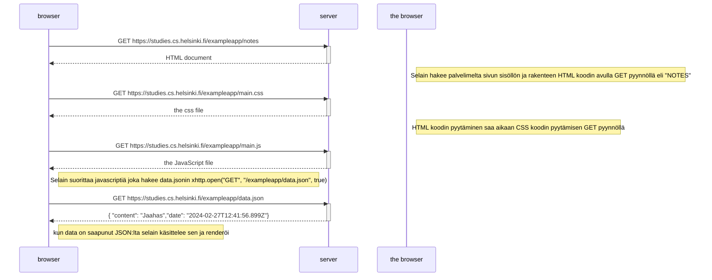

```mermaid
    sequenceDiagram
    participant browser
    participant server
    
    browser->>server: GET https://studies.cs.helsinki.fi/exampleapp/notes
    activate server
    server-->>browser: HTML document
    deactivate server

    Note right of the browser: Selain hakee palvelimelta sivun sisöllön ja rakenteen HTML koodin avulla GET pyynnöllä eli "NOTES"
    
    browser->>server: GET https://studies.cs.helsinki.fi/exampleapp/main.css
    activate server
    server-->>browser: the css file
    deactivate server
    Note right of the browser: HTML koodin pyytäminen saa aikaan CSS koodin pyytämisen GET pyynnöllä
    
    browser->>server: GET https://studies.cs.helsinki.fi/exampleapp/main.js
    activate server
    server-->>browser: the JavaScript file
    deactivate server
    
    Note right of browser: Selain suorittaa javascriptiä joka hakee data.jsonin xhttp.open("GET", "/exampleapp/data.json", true)
    
    browser->>server: GET https://studies.cs.helsinki.fi/exampleapp/data.json
    activate server
    server-->>browser:     { "content": "Jaahas","date": "2024-02-27T12:41:56.899Z"}
    deactivate server    

    Note right of browser: kun data on saapunut JSON:lta selain käsittelee sen ja renderöi
```
