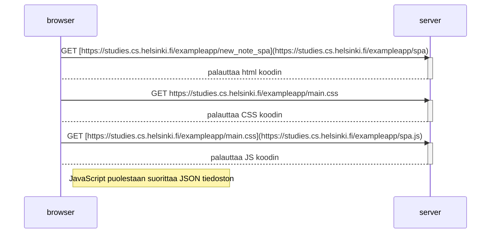

```mermaid
    sequenceDiagram
      participant browser
      participant server

      browser->> server: GET [https://studies.cs.helsinki.fi/exampleapp/new_note_spa](https://studies.cs.helsinki.fi/exampleapp/spa)
      activate server
      server--> browser: palauttaa html koodin
      deactivate server

      browser->> server: GET https://studies.cs.helsinki.fi/exampleapp/main.css
      activate server
      server--> browser: palauttaa CSS koodin
      deactivate server

      browser->> server: GET [https://studies.cs.helsinki.fi/exampleapp/main.css](https://studies.cs.helsinki.fi/exampleapp/spa.js)
      activate server
      server--> browser: palauttaa JS koodin
      deactivate server

      Note right of browser: JavaScript puolestaan suorittaa JSON tiedoston

```
